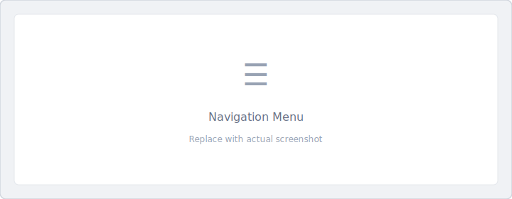

# Common Features

These features are available to all users regardless of role.

## Feature Overview

| Feature | Description | Editable? |
|---------|-------------|-----------|
| [Profile](profile.md) | Change roles, set location | Yes |
| Sign Out | Log out of application | — |
| Current Version | View app version | No |
| [Dark/Light Mode](theme.md) | Switch display theme | Yes |
| [Messages](messages.md) | View notifications | Yes |
| [Language](language.md) | Change app language | Yes |
| About | View app information | No |

## Accessing Features

All common features are available from the left navigation menu:

1. Click the **☰** icon at the top left of any screen.
2. Scroll to see all available features.
3. Click to access

## Quick Reference

### Profile

Configure your user settings and change roles if you have multiple role access.

[Profile Settings :material-arrow-right:](profile.md){ .md-button }

### Sign Out

Logs you out and returns to the login screen.

### Current Version

Displays the current application version (view only). Useful for support requests.

### Dark/Light Mode

Switch between dark and light display themes for comfortable viewing.

[Theme Settings :material-arrow-right:](theme.md){ .md-button }

### Messages

Check for in-app notifications and messages.

[Messages :material-arrow-right:](messages.md){ .md-button }

### Language

Change the application language:

- English (US)
- Español
- Français

[Language Settings :material-arrow-right:](language.md){ .md-button }

### About

View application details, user information, and server information.

## Related Documentation

- [Searching and Filtering Data](search-filter.md)
- [User Roles](../roles/index.md)
