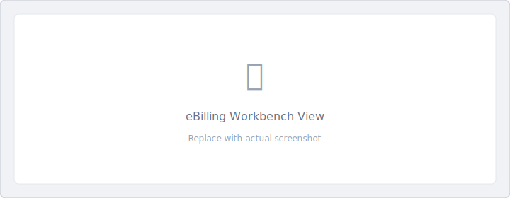

# eBilling Workbench View

The eBilling Workbench is the central hub for managing service receipts, delivery tickets, and billing operations.

!!! tip "Quick Actions"
    :material-magnify: [Find Tickets](../how-to/find-tickets.md) · :material-receipt: [Create Service Receipt](../how-to/create-sr-ticket.md) · :material-package-up: [Pick Up Bits](../how-to/pickup-bits.md) · :material-alert-circle: [Pick Up DBR/LIH](../how-to/pickup-dbr-lih.md) · :material-crosshairs-question: [Where Is My Bit?](../how-to/find-my-bit.md)

!!! info "Role Availability"
    This view is available to: Field Sales, Billing, Account Rep, Finance

!!! note "Access Levels"
    - **Field Sales & Billing** — Full edit access.
    - **Account Rep & Finance** — View-only access.

## Overview

The eBilling Workbench displays ticket lines with various statuses, allowing you to track bits through the billing lifecycle.

## Quick Actions Bar

| Button | Function |
|--------|----------|
| **Home** | Return to your role's home page |
| **Find Bits** | Navigate to Find Bits view |
| **Print Historical PDF** | Select and print past delivery tickets |

## Filtering Ticket Lines

### eBilling Filter

The **EBILLING FILTER** dropdown provides preset filter options:

| Filter Option | Description |
|---------------|-------------|
| Active Tickets | Shows active ticket lines (excludes history and approved/locked) |
| My Tickets | Shows only your assigned ticket lines |
| Show History | Shows invoiced or pick-up-new ticket lines |
| Approved and Locked | Shows approved and locked ticket lines |
| Created Date Range | Filter by creation date |
| Updated Date Range | Filter by last update date |
| Serial Number | Search by specific serial number |
| Ready to Review | Shows only ticket lines ready for review |

!!! tip "District Scope"
    All eBilling filters show only tickets within your profile's selected district.

### Sales Person Filter

The **SALES PERSON FILTER** dropdown lets you filter by a specific sales representative in your district.

### Saving Filters

1. Set your preferred **EBILLING** and **SALES PERSON** filters.
2. Click **Save filter** to remember these settings.
3. Click **Clear filter** to reset to defaults.

!!! warning "Troubleshooting"
    If the eBilling Workbench appears empty, try clearing your saved filters. Saved filters may exclude all current results.

## Working with the Table

### Sorting

=== "Desktop/iPad"

    1. Click to the left of the funnel icon in a column header to reveal the sort arrows.
    3. Click the up or down arrow to sort ascending or descending.
    4. Click the funnel icon again to remove the current sort order.

=== "Mobile"

    1. Tap **Workbench Sort Order**.
    2. Arrange options in your preferred order.
    3. Tap **Sort** or **Sort and Save Sort Order** to apply the sort.

### Filtering Columns

=== "Desktop/iPad"

    1. Click the funnel icon in a column header.
    2. Check the options you want to filter by.
    3. Filters remain in place until cleared or the application is restarted.

=== "Mobile"

    Column filters are not available on mobile. Use the EBILLING and SALES PERSON filters instead.

### Clearing Filters

| Platform | Action |
|----------|--------|
| Desktop/iPad | Click **Clear filter-sort** button |
| Mobile | Use **Clear filter** button (clears sort order too) |

!!! note
    The **Clear filter-sort** button only affects table sorting and column filters. It does not clear the eBilling or Sales Person filters.

## Ticket Line Actions

Click any ticket line to open the **Line Action Menu**.

### Available Actions by Status

| Action | Billed | Reviewed/Approved | Approved & Locked | Invoiced |
|--------|:------:|:-----------------:|:-----------------:|:--------:|
| Edit Well Information | ✅ | ✅* | ❌ | ❌ |
| Print/Share SR Billing PDF | ✅ | ✅ | ✅ | ✅ |
| Print/Share SR Bit Runs PDF | ✅ | ✅ | ✅ | ✅ |
| Add Stamped PDF/Photo | ✅ | ✅* | ❌ | ❌ |
| View Service Receipt Lines | ✅ | ✅ | ✅ | ✅ |

*Billing role only; Field Sales has view-only access at this status

### Printing PDFs

From the line action menu:

1. Click **Print / Share SR Billing PDF** for billing documentation.
2. Click **Print / Share SR Bit Runs PDF** for bit run reports.
3. The print preview opens for printing or sharing.

## Locked Serials

Toggle **See Locked Serials** to include or exclude locked bits from the display.

## Common Tasks

- :material-magnify: [Find Tickets](../how-to/find-tickets.md)
- :material-receipt: [Create Service Receipt](../how-to/create-sr-ticket.md)
- :material-package-up: [Pick Up Bits](../how-to/pickup-bits.md)
- :material-alert-circle: [Pick Up DBR or LIH Bits](../how-to/pickup-dbr-lih.md)
- :material-crosshairs-question: [Where Is My Bit?](../how-to/find-my-bit.md)

## Related Documentation

- [Understanding Line Statuses](../reference/line-statuses.md)
- [Permissions Matrix](../admin/permissions-matrix.md)
- [Searching and Filtering Data](../features/search-filter.md)
